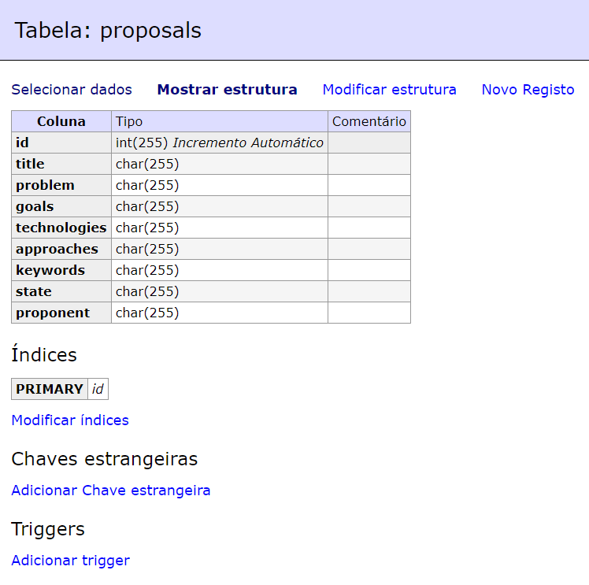
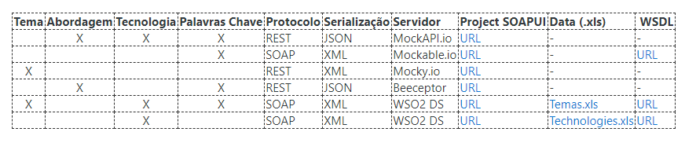

# INSIS 2020-2021 PROJETO

[P1 documentation](./p1.md)

In folder ``p2_support`` you have Postman collections.

## Data Services  

## Proposals data Service configuration  

```xml
<data name="proposals_dataService" transports="http https local">
   <config enableOData="false" id="mongo_proposals">
      <property name="driverClassName">com.mysql.jdbc.Driver</property>
      <property name="url">jdbc:mysql://localhost:3306/db</property>
      <property name="username">root</property>
      <property name="password">root</property>
   </config>
   <query id="retrieve_proposals" useConfig="mongo_proposals">
      <sql>select id, title, problem, goals, technologies, approaches, keywords, state, proponent from proposals</sql>
      <result element="proposals" rowName="proposal">
         <element column="title" name="title" xsdType="string"/>
         <element column="problem" name="problem" xsdType="string"/>
         <element column="goals" name="goals" xsdType="string"/>
         <element column="technologies" name="technologies" xsdType="string"/>
         <element column="approaches" name="approaches" xsdType="string"/>
         <element column="keywords" name="keywords" xsdType="string"/>
         <element column="state" name="state" xsdType="string"/>
         <element column="id" name="id" xsdType="string"/>
         <element column="proponent" name="proponent" xsdType="string"/>
      </result>
   </query>
   <query id="insert_proposal" returnGeneratedKeys="true" useConfig="mongo_proposals">
      <sql>insert into proposals (title, problem, goals, technologies, approaches, keywords, state, proponent) values (:title, :problem, :goals, :technologies, :approaches, :keywords, :state, :proponent)</sql>
      <result element="GeneratedKeys" rowName="proposal" useColumnNumbers="true">
         <element column="1" name="ID" xsdType="integer"/>
      </result>
      <param name="title" sqlType="STRING"/>
      <param name="problem" sqlType="STRING"/>
      <param name="goals" sqlType="STRING"/>
      <param name="technologies" sqlType="STRING"/>
      <param name="approaches" sqlType="STRING"/>
      <param name="keywords" sqlType="STRING"/>
      <param name="state" sqlType="STRING"/>
      <param name="proponent" sqlType="STRING"/>
   </query>
   <query id="retrieve_proposal_state" useConfig="mongo_proposals">
      <sql>select id, title, problem, goals, technologies, approaches, keywords, state from proposals where state = :state</sql>
      <result element="proposals" rowName="proposal">
         <element column="id" name="id" xsdType="string"/>
         <element column="title" name="title" xsdType="string"/>
         <element column="problem" name="problem" xsdType="string"/>
         <element column="goals" name="goals" xsdType="string"/>
         <element column="technologies" name="technologies" xsdType="string"/>
         <element column="approaches" name="approaches" xsdType="string"/>
         <element column="keywords" name="keywords" xsdType="string"/>
         <element column="state" name="state" xsdType="string"/>
      </result>
      <param name="state" sqlType="STRING"/>
   </query>
   <query id="update_proposal" useConfig="mongo_proposals">
      <sql>UPDATE proposals SET state = :state WHERE id = :id</sql>
      <param name="state" sqlType="STRING"/>
      <param name="id" sqlType="STRING"/>
   </query>
   <resource method="GET" path="/proposal">
      <call-query href="retrieve_proposals"/>
   </resource>
   <resource method="POST" path="/proposal">
      <call-query href="insert_proposal">
         <with-param name="title" query-param="title"/>
         <with-param name="problem" query-param="problem"/>
         <with-param name="goals" query-param="goals"/>
         <with-param name="technologies" query-param="technologies"/>
         <with-param name="approaches" query-param="approaches"/>
         <with-param name="keywords" query-param="keywords"/>
         <with-param name="state" query-param="state"/>
         <with-param name="proponent" query-param="proponent"/>
      </call-query>
   </resource>
   <resource method="GET" path="/proposal/state">
      <call-query href="retrieve_proposal_state">
         <with-param name="state" query-param="state"/>
      </call-query>
   </resource>
   <resource method="PUT" path="/proposal/updateState">
      <call-query href="update_proposal">
         <with-param name="state" query-param="state"/>
         <with-param name="id" query-param="id"/>
      </call-query>
   </resource>
</data>
```

## Technologies data Service configuration  

Add in EI-HOME/samples/data-services/resources the *Technologies.xls* file.

```xml  
<data name="Technologies" transports="http https local">
   <config enableOData="false" id="TechnologiesXSL">
      <property name="excel_datasource">./samples/data-services/resources/Technologies.xls</property>
   </config>
   <query id="QTechnologies" useConfig="TechnologiesXSL">
      <excel>
         <workbookname>technology</workbookname>
         <hasheader>true</hasheader>
         <startingrow>2</startingrow>
         <maxrowcount>-1</maxrowcount>
         <headerrow>1</headerrow>
      </excel>
      <result element="Technologies" rowName="technology">
         <element column="Id" name="Id" xsdType="string"/>
         <element column="Name" name="Name" xsdType="string"/>
      </result>
   </query>
   <operation name="GetTechnologies">
      <call-query href="QTechnologies"/>
   </operation>
</data>
```

## Themes data Service configuration  

Add in EI-HOME/samples/data-services/resources the *Temas.xls* file.

```xml  
<data name="Themes" transports="http https local">
   <config enableOData="false" id="ThemesXLSX">
      <property name="excel_datasource">./samples/data-services/resources/Temas.xls</property>
   </config>
   <query id="Q1" useConfig="ThemesXLSX">
      <excel>
         <workbookname>tema</workbookname>
         <hasheader>true</hasheader>
         <startingrow>2</startingrow>
         <maxrowcount>6</maxrowcount>
         <headerrow>1</headerrow>
      </excel>
      <result element="Temas" rowName="Tema">
         <element column="Id" name="Id" xsdType="string"/>
         <element column="Nome" name="Nome" xsdType="string"/>
         <element column="PalavrasChave" name="PalavrasChave" xsdType="string"/>
         <element column="Tecnologia" name="Tecnologia" xsdType="string"/>
      </result>
   </query>
   <operation name="GetThemes">
      <call-query href="Q1"/>
   </operation>
</data>
```

## Database  

***Start docker.**  

Go to folder *p2_docker* and start by using ``docker-compose up``.

In EI-HOME/wso2/lib add ``mysql-connector-java-8.0.24.jar``.

**Database engine:** MySQL  
**Server:** mysqlsrv   
**User:** root  
**Password:**  root  
**Database:** db

Create table as shown in image.  


## Rest endpoints

### Data sources

Following the this table:  
  


### Students

GET - https://run.mocky.io/v3/7217fbcd-8590-4609-816d-22863a539846

```json
[
  {
    "id": 1,
    "name": "John Doe",
    "email": "1161393@isep.ipp.pt",
    "username": "student1"
  },
  {
    "id": 2,
    "name": "Mary Jane",
    "email": "1161393@isep.ipp.pt",
    "username": "student2"
  },
  {
    "id": 3,
    "name": "Ana Maria",
    "email": "1161491@isep.ipp.pt",
    "username": "student3"
  },
  {
    "id": 4,
    "name": "Ze Manel",
    "email": "1161491insis2021@gmail.com",
    "username": "student4"
  },
  {
    "id": 5,
    "name": "To Quim",
    "email": "1160941@isep.ipp.pt",
    "username": "student5"
  },
  {
    "id": 6,
    "name": "Carlota Joaquina",
    "email": "1160941@isep.ipp.pt",
    "username": "student6"
  }
]
```

### Teachers  

GET - https://run.mocky.io/v3/cfcf6743-8e48-426d-83bb-f1d7dcb6983f

```json
[
	{
		"id": 1,
		"name": "Maria Manuel",
		"email": "1161393@isep.ipp.pt",
		"username": "teacher1"
	},
	{
		"id": 2,
		"name": "Antonio Pinto",
		"email": "1161393@isep.ipp.pt",
		"username": "teacher2"
	},
	{
		"id": 3,
		"name": "Filipe Silva",
		"email": "1161491@isep.ipp.pt",
		"username": "teacher3"
	},
	{
		"id": 4,
		"name": "Ana Pereira",
		"email": "1161491insis2021@gmail.com",
		"username": "teacher4"
	},
	{
		"id": 5,
		"name": "Ricardo Manuel",
		"email": "1160941@isep.ipp.pt",
		"username": "teacher5"
	},
	{
		"id": 6,
		"name": "Zeca Maria",
		"email": "1160941@isep.ipp.pt",
		"username": "teacher6"
	}
]
```

### Propoenents

GET - https://run.mocky.io/v3/156e14d0-2392-4e50-a974-0b8670c11ce8  

```json
[
    {
        "id": 1,
        "name": "Joaquim Proponent",
        "email": "1161393@isep.ipp.pt",
        "username": "proponent1"
    },
    {
        "id": 2,
        "name": "Antonio Proponent",
        "email": "1161491@isep.ipp.pt",
        "username": "proponent2"
    },
    {
        "id": 2,
        "name": "Maria Proponent",
        "email": "1160941@isep.ipp.pt",
        "username": "proponent3"
    }
]
```

