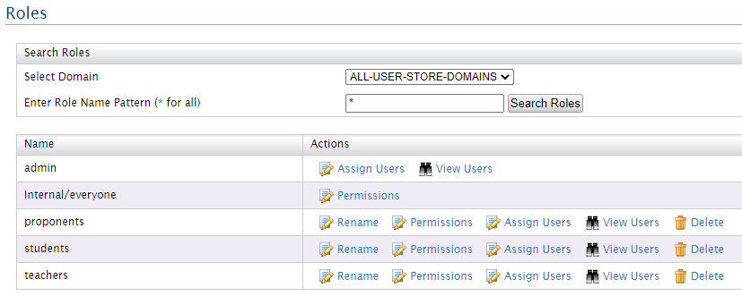
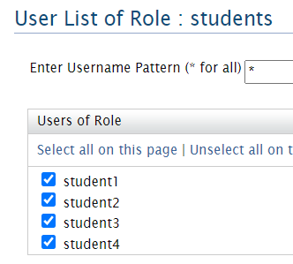
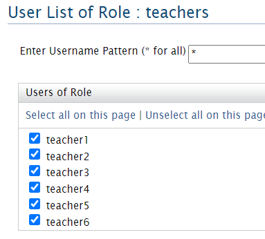
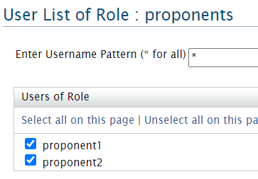

# INSIS 2020-2021 PROJETO


## Rest endpoints

### Students

GET - https://run.mocky.io/v3/c28a1d41-6eb2-42dc-a52a-83404ffd6394

```json
[
	{
		"id": 1,
		"name": "John Doe",
		"email": "1161393@isep.ipp.pt",
		"username": "student1"
	},
	{
		"id": 2,
		"name": "Mary Jane",
		"email": "1161393@isep.ipp.pt",
		"username": "student2"
	},
	{
		"id": 3,
		"name": "Ana Maria",
		"email": "1161491@isep.ipp.pt",
		"username": "student3"
	},
	{
		"id": 4,
		"name": "Ze Manel",
		"email": "1161491insis2021@gmail.com",
		"username": "student4"
	}
]
```

### Keywords

GET - https://run.mocky.io/v3/ca6c1bfb-558a-40e3-be1f-9a6f16590da7

```json
[
  {
    "id": 1,
    "name": "java"
  },
  {
    "id": 2,
    "name": "ddd"
  },
  {
    "id": 3,
    "name": "javascript"
  },
  {
    "id": 4,
    "name": "react"
  },
  {
    "id": 5,
    "name": "frontend"
  },
  {
    "id": 6,
    "name": "backend"
  }
]
```

### Approaches

GET - https://run.mocky.io/v3/dc91104a-a947-4354-9f5d-f498ec5f7819

```json
[
  {
    "id": 1,
    "name": "ddd"
  },
  {
    "id": 2,
    "name": "model based"
  },
  {
    "id": 3,
    "name": "top-down"
  }
]
```

### Probable technologies

GET - https://run.mocky.io/v3/24988b29-abf2-486b-a3f9-106c76904fa4

```json
[
  {
    "id": 1,
    "name": "java"
  },
  {
    "id": 2,
    "name": "react"
  },
  {
    "id": 3,
    "name": "javascript"
  },
  {
    "id": 4,
    "name": "flutter"
  },
  {
    "id": 5,
    "name": "c#"
  },
  {
    "id": 6,
    "name": "bps"
  }
]
```  

### Teachers List  

GET - https://run.mocky.io/v3/43dd8a71-db96-4a10-b46c-750d919c49cb

```json
[
	{
		"id": 1,
		"name": "Maria Manuel",
		"email": "1161393@isep.ipp.pt",
		"username": "teacher1"
	},
	{
		"id": 2,
		"name": "Antonio Pinto",
		"email": "1161393@isep.ipp.pt",
		"username": "teacher2"
	},
	{
		"id": 3,
		"name": "Filipe Silva",
		"email": "1161491@isep.ipp.pt",
		"username": "teacher3"
	},
	{
		"id": 4,
		"name": "Ana Pereira",
		"email": "1161491@isep.ipp.pt",
		"username": "teacher4"
	},
	{
		"id": 5,
		"name": "Ricardo Manuel",
		"email": "1161393@isep.ipp.pt",
		"username": "teacher5"
	},
	{
		"id": 6,
		"name": "Zeca Maria",
		"email": "1161491insis2021@gmail.com",
		"username": "teacher6"
	}
]
```  

### Proponents List  

GET - https://run.mocky.io/v3/62b91a75-8a51-4757-b9c6-8d1e8f08fc15

```json  
[
	{
		"id": 1,
		"name": "Joaquim Proponent",
		"email": "1161393@isep.ipp.pt",
		"username": "proponent1"
	},
	{
		"id": 2,
		"name": "Antonio Proponent",
		"email": "1161491@isep.ipp.pt",
		"username": "proponent2"
	}
]
```  

## Config file  

In EI-HOME/wso2/business-process/conf folder we added an configuration file.  

An example of the **myconfig.properties**  file:  
```  
timeLimit=60
retry=true
notificationType=email
rucEmail=1161491@isep.ipp.pt
```  

## Activity.xml

The following was added to activity.xml file:

```
<property name="customFormTypes">
	<list>
		<bean class="form.type.multiselect.MultiSelectFormType"/>
		<bean class="form.type.table.TableType"/>
		<bean class="form.type.list.ListType"/>
		<bean class="form.type.simpleselect.SimpleSelectFormType"/>
	</list>
</property>
```

## Roles and Users in BPS  

### Roles  
  

### Students  
  

### Teachers  
  

### Proponents  
  

